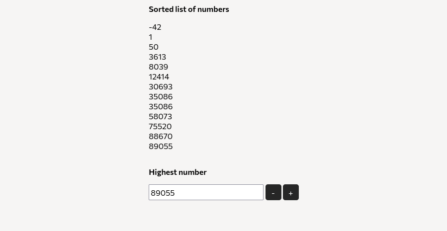

# Algorithm and Web Development Assessment

This is my take of the Bitė Web Internship 2025 assessment task.

> [!IMPORTANT]
> This is the <b>simple</b> variant of the submission. Check out the other branch for a more complex variant
with more algorithms and capabilities.

## Getting Started
Code running options are the same as the ones provided for the task, which are listed below:

### Option 1: Using Docker (Recommended)
A Docker environment has been provided for your convenience.

1. Make sure you have Docker and Docker Compose installed on your system
2. Clone this repository
3. Navigate to the repository directory
4. Run `docker-compose up -d`
5. Access the application at http://localhost:8080

### Option 2: Local Setup
If you prefer not to use Docker:

1. Set up a local PHP environment (XAMPP, WAMP, MAMP, etc.)
2. Clone this repository to your web server's document root
3. Access the application via your local web server


### Project Structure
```
.
├── docker-compose.yml         # Docker configuration
├── data/                      # Data directory
│   └── input.txt              # Input file with random numbers
├── src/                       # Source code directory
│   ├── index.php              # Main entry point
│   └── css/                   # CSS file directory
│       └── style.css          # Styling file
└── README.md                  # This file
```

## Design decisions

For the design of the page itself, I created a very simple interface based on the wireframe provided in the task
description.


All the code in the project is kept inside the single index.php file, as I felt the scope of the project is narrow enough
not to need additional separation.

For this variant, I only used the in-built PHP sort() function, based on QuickSort, to sort the list of numbers.